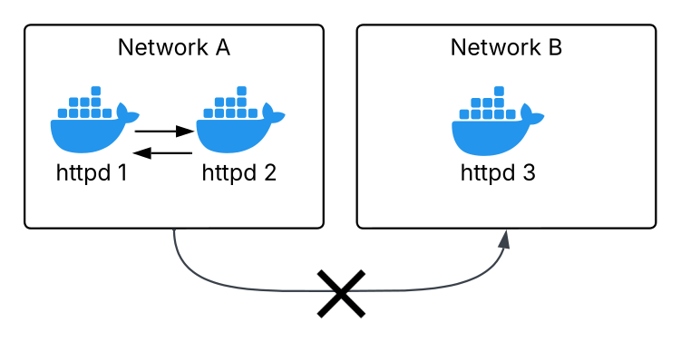

```bash
docker build . -t nhttpd
docker run --name s1 --hostname s1 -d nhttpd
docker run --name s2 --hostname s2 -d nhttpd
docker run --name s3 --hostname s3 -d nhttpd

docker network create netA
docker network create netB

docker network connect netA s1
docker network connect netA s2
docker network connect netB s3

docker network disconnect bridge s1
docker network disconnect bridge s2
docker network disconnect bridge s3
```

**Obs:** network bridge (docker default network) does not resolve other hostname container dns. It only communicates via ip. Will you create another network then by default it will have dns resolved.  

#### test communication between containers: ####
inside the s1 container: `docker exec -it s1 bash`  
`curl s1` (should work)  
`curl s2` (should work)  
`curl s3` (should not work)  

`traceroute s2` (only one hop)  
####

