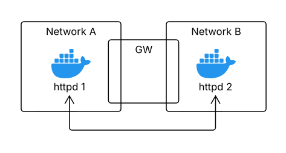

```bash
docker build . -t nhttpd

# give network admin permission for command "ip add"
docker run --name s1 --hostname s1 --cap-add=NET_ADMIN -d nhttpd
docker run --name s2 --hostname s2 --cap-add=NET_ADMIN -d nhttpd

docker network create netA --subnet 10.0.0.0/24
docker network create netB --subnet 10.0.1.0/24

docker network connect netA s1
docker network connect netB s2

docker network disconnect bridge s1
docker network disconnect bridge s2

# create the Gateway router between the two networks
docker run --name gw --network netA --cap-add=NET_ADMIN -d nhttpd
docker network connect netB gw

docker exec -it s1 bash
# search for the gw ip on network netA
ip route add 10.0.0.0/24 via <gw_ip_netA> 

docker exec -it s1 bash
# search for the gw ip on network netB
ip route add 10.0.1.0/24 via <gw_ip_netB> 
```
