# kubernetes

[Config](#config)  
[Container](#container)  
[Deployment](#deployment)  
[Deployment Strategies](#deployment-strategies)  
[Sidecar Container](#sidecar-container)  
[Command and Args](#command-and-args)  
[Label](#label)  
[Service](#service)  
[Replicate](#replicaset)  
[Inside Container](#inside-container)  
[Taint Tolerate](#taint-tolerate)  
[NodeSelector and Label](#nodeselector-and-label)  
[Affinity and Label](#affinity-and-label)  
[InitContainer](#initcontainer)  
[Ingress](#ingress)  
[Config](#config)  
[Readiness and Liveness Probe](#readiness-and-liveness-probe)  
[ServiceAccount](#service-account)  
[Job](#job)  
[Cronjob](#cronjob)  
[Network Policy](#network-policy)  
[Volume](#volume)  
[ConfigMap](#config-map) 
[Secret](#secret) 
[Statefulset](#statefulset) 
<br />

```bash
# kubectl version
kubernetes version runing inside the node

# list all resources
kubectl get resources

# explain fields and structures
kubectl explain [resource]

# list all resources from namespace
kubectl get all --namespace=[namespace]

# list all namespaces
kubectl get ns

kubectl get [resource] --selector [label]
kubectl get [resource] --all-namespaces
# -A --all-namespaces
# -n [namespace] specific namespace


# current pod status status
kubectl -n default get pod [pod] -o jsonpath="{.status.phase}"

kubectl [command] [resource] [resource_name]
# commands: create, delete, edit, describe
# resources: pod, node, deploy, service, replicaset

# create a new pod yaml file
kubectl run [pod_name] --image=(image) --dry-run -o yaml > redis.yaml
# --dry-run // not to run
# -o yaml // display in a yaml file

# apply updates to current created resource
kubectl create -f redis.yaml
kubectl apply -f redis.yaml

# delete the preview resource then deploy the new one
kubectl replace --force -f [file.yaml]

# edit file vim and upload the updates on save
kubectl edit pod [pod]

# get all logs from container inside the pod
kubectl logs [pod] -c [container] 

# redirect the WARNINGS to file /opt/logs.txt from controlplane node
kubectl logs [pod] -c [container] | grep WARNINGS > /opt/logs.txt

# get nodes cpu and memory consumption  
kubectl top [node | pod]  

```
<br />

## Container

```bash
# create a temporary pod to run command
# curl http://[service].[nameserver]:[port]
kubectl run [pod] --rm --restart=Never --image=(image) -i -- [command]

# run command inside a pod
kubectl exec [pod] -it -- [command]
```

<br />

## Config
```bash
kubectl config view

# change current namespace
kubectl config set-context --current --namespace=[namespace]

# list contexts
kubectl config get-contexts

# change context
kubectl config use-context [context]
```
`.kube/config`

<br />

## Deployment
```bash
kubectl create deploy [deploy] --image=(image)

kubectl create deploy httpd-frontend --image=httpd:2.4-alpine --replicas=3
kubectl set deploy [deployment] [image]

# scale
kubectl scale deploy --replicas=(num) [deploy]

# rollout
kubectl rollout status deployment/[deployment]
kubectl rollout history deployment/[deployment]

# See the pod template spec used in that revision
# but not the pod execution result (status/errors).
kubectl rollout history deployment/[deployment] --revision=(number)

kubectl rollout undo deployment [deployment]
```

```yaml
spec:
  - strategy:
    rollingUpdate:
      maxSurge: 25%
      maxUnavailable: 25%
    type: RollingUpdate
```

```yaml
spec:
  - strategy:
    type: Recreate
```

<br />

## Deployment strategies

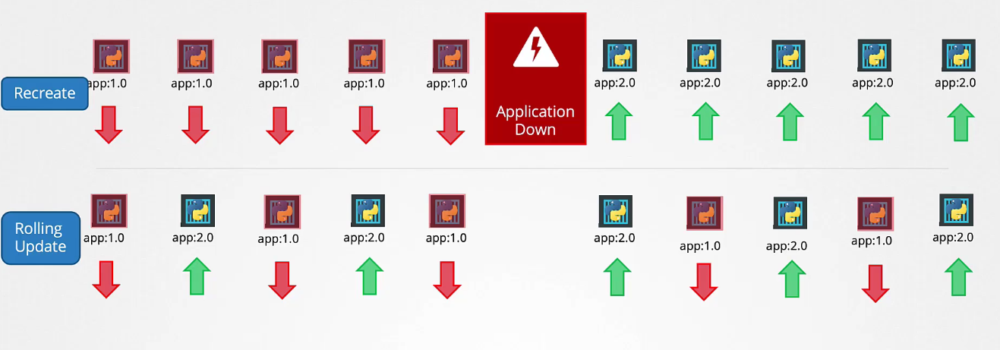  

### Canary

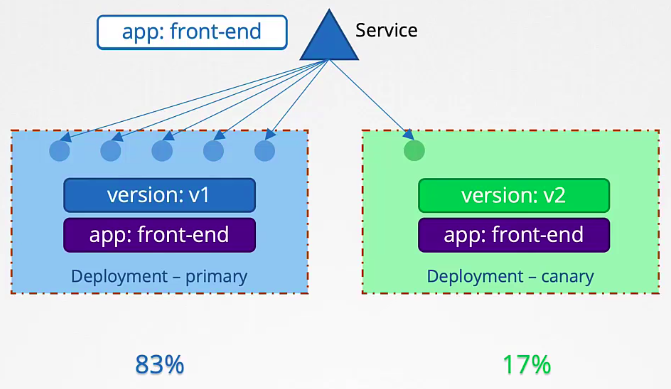  

<br />

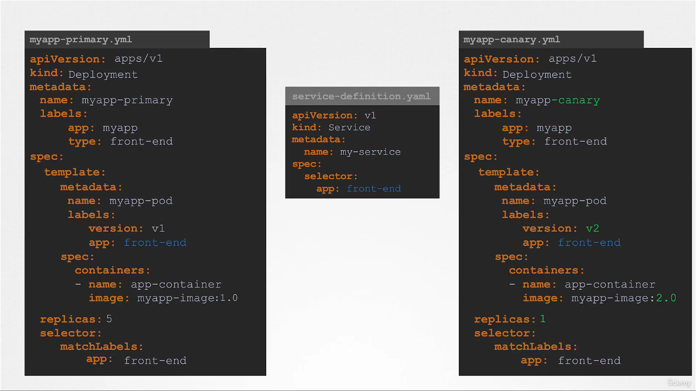  

Create another deploy v2, then divide the replicas between deploy v1 and v2.  

### Blue Green

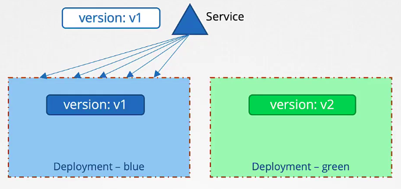  

<br />

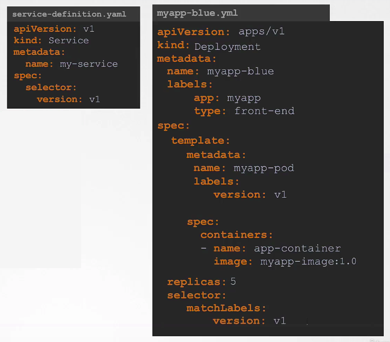  

Create another deploy v2 then for full deployment, then update service selector to v2.  

<br />

## Sidecar Container

[(see example)](sidecar-container.yaml)

The **init** container will create the initial file `cleaner.log`.  
**cleaner-con** will send the logs be storaged in the volume.  
**logger-con** will write content of `cleaner.log` to stdout will comand `tail -f`.  
The logs will be available on `k logs cleaner`.  
<br />

## Command and Args

**Obs:** command overwrites the entrypoint from docker image and args overwrites cmd.  

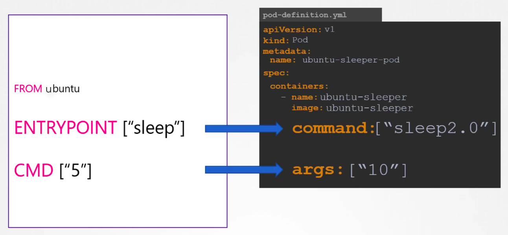  

<br />

```yaml
# to use a long command
command: ["/bin/sh"]
args: ["-c", "while true; do echo hello; sleep 10;done"]
```

<br />

## Label

```bash
# add label protected=true to all pods labeld type=worker
k label pod -l type=worker protected=true
k label pod -l type=worker protected=true

# same for annotate
k annotate pod -l type=worker protected=true

# list pods with all labels
k get pods --show-labels

# get pods with selected label
k get pods -l protected=true
```

<br />

## Service
```bash
# display service url
minikube service [service] --url
```

**Obs:** Service and Deploy are linked by selector. It should always select the pod not the deploy.  
<br />

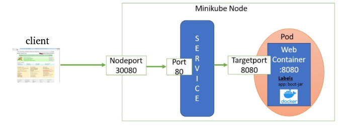  

Here the external client will call the **nodeport 30080** which has been exposed to the external client.  
This request will then be forwarded to service **port 80** on which the kubernetes service is deployed and then finally to **target port 8080** which is the port on which the pod application is running.  

<br />

| Field        | Meaning                                        |
| ------------ | ---------------------------------------------- |
| `port`       | Port exposed by the **Service** (e.g., 80)     |
| `targetPort` | Port on the **Pod/container** to forward to. It must match the port the container is actually listening to.   |
| `nodePort`   | (for `NodePort` type) Port exposed on the Node |


> A Service can expose a container even without **containerPort**,  
> as long as the containerized app is actually listening on the **targetPort**.  


### expose

```bash
kubectl expose pod [pod] --port=80 --target-port=8080

# creates and exposes a service
kubectl expose deployment [deploy] --port=[port] --name [service_name]

# test exposed service
curl http://my-service.default.svc.cluster.local:8080

# or 
kubectl -n [namespace] run [pod] --restart=Never --rm -i --image=[image] -- curl -m 3 [service_name]:[port]

# service expose nodePort to all nodes regardless of which node a pod is running on.
# should work inside the cluster
curl [any_node_ip]:[nodePort] 
```

<br />

## Replicaset

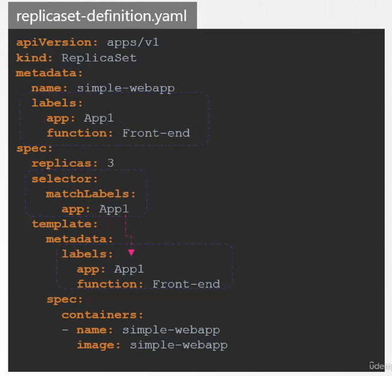   
<br /><br />
**Obs: matchLabels connect replicaset to the pod**

```bash
# replace replicaset // it wont automatically replace the existing pods
kubectl replace -f replicaset.yaml

# scale without updating the file
kubectl scale --replicas=6 -f replicaset.yaml

# create a temporary replicaset edit file that will upload the changes
# edit does not automatically replace the current pods
kubectl edit replicaset [replicaset]
```
<br />

## Inside Container
```bash
# container user
kubectl exec [pod] -- whoami

kubectl exec -it [pod] -c [container] -- [command]

# enter container terminal
kubectl exec -it [pod] -- /bin/sh
```
<br />

## Taint Tolerate
"Keep pods away unless they explicitly tolerate me"

[Pod tolerate (see example)](pod-tolerate.yaml)
```bash
kubectl taint node [node] [key]=[value]:[effect]
```
#### Effect
`NoSchedule` → Don't schedule unless tolerated  
`PreferNoSchedule` → Try to avoid, but not enforced  
`NoExecute` → Evicts existing pods unless tolerated  

<br />

## NodeSelector and Label
"I want my pod to go there"

### Label the node
```bash
kubectl label nodes [node] [label]=[value]
```

### NodeSelector
[Pod NodeSelector (see example)](pod-nodeSelector.yaml)
<br />
<br />

## Affinity and Label
"I want my pod to go there"  

[Pod Affinity (see example)](pod-affinity.yaml)

### yaml config

<details>
  <summary>operator <code>IN, OR, NotIn, Exists </code></summary>
  
  IN: 
  ```yaml
  - matchExpressions:
    - key: disktype
      operator: In
      values:
      - ssd
  ```

  Exists:
  ```yaml
  - matchExpressions:
    - key: color
      operator: Exists
  ```
</details>

<details>
  <summary> type</summary>
  
  type1: `requiredDuringSchedulingIgnoredDuringExecution`  
  type2: `preferredDuringSchedulingIgnoredDuringExecution`  
  type3: `requiredDuringSchedulingRequiredDuringExecution`  

  
</details>

<details>
  <summary>nodeAffinity, podAffinity</summary>
  
  #### nodeAffinity
  "Schedule this pod on nodes with specific labels."  
  &emsp; • Targets: Nodes  
  &emsp; • Uses: Node labels  
  &emsp; • Purpose: Restrict or prefer scheduling on certain nodes  

  #### podAffinity
  "Schedule this pod near (on the same node or zone as) other matching pods."  
  &emsp; • Targets: Pods (on other nodes)  
  &emsp; • Uses: Pod labels, plus topology (e.g. node, zone)  
  &emsp; • Purpose: Co-locate related pods for performance, latency, or shared resources  

</details>

<br />

## InitContainer
[(see example)](pod-init-container.yaml)

• Kubernetes runs all Init Containers sequentially.  
• Each must complete successfully (exit 0) before the next starts.  
• If one fails, it will retry until it succeeds or the Pod fails.  
• Once all Init Containers finish, the main containers start.  

<br />

## Ingress

```bash
# add service to ingress path
kubectl create ingress [ingress] -n [namespace] --rule="/[path]=[service]:[port]"
```

<br />

### Deploy Ingress Controller

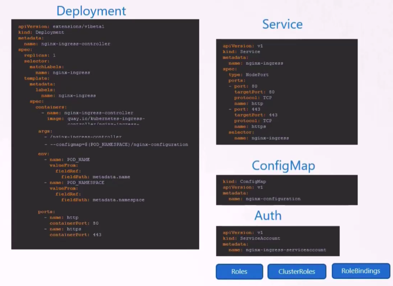

## Route exposed services

Service exposes on port 8080  
Can be accessed on url http://watch.ecom-store.com/video  
[(see example)](ingress-route-exposed-services.yaml)

<br />

## Config

```bash
# by default the kubeconfig file is $HOME/.kube/config
# use to anoter kube config file 
k get pods --kubeconfig [config_file_path]

# view config file fields
k config view
```

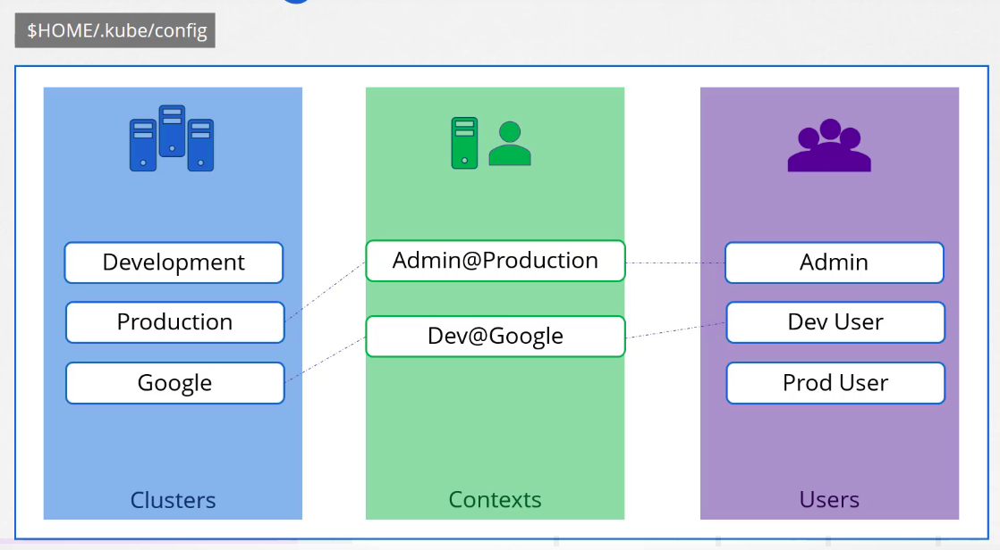


<br />
<br />

## Readiness and Liveness Probe


`livenessProbe`: If it fails Kubernetes will restart the container.  
`readinessProbe`: If it fails, the pod is removed from the Service’s load balancer. The container is not restarted, just marked as not ready.  

`livenessProbe.tcpSocket.port`: check if port is reachable.  

---

`initialDelaySeconds`: This is the number of seconds to wait after the container starts before Kubernetes performs the first health check.  
`periodSeconds`: This is the interval between successive probes, after the initial delay.  

• Use a higher `initialDelaySeconds` if your app takes a while to initialize.  
• Use a short `periodSeconds` if you want quick detection of health/readiness issues.  

**Obs:** By setting `periodSeconds`, Kubernetes repeatedly checks the app's health — not just once. If it fails for a certain number of times (set by `failureThreshold`), the container is automatically restarted.  

<br />

## ServiceAccount

**Obs**: You can not update a pod service account, yo must recreate a pod to update.  

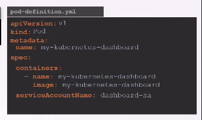

<br />

## Job

[(see example)](job.yaml)  
`completions`: number of required completed jobs.  
`paralelism`: number of jobs to run at the same time.  

**obs:** jobs gets created sequentially by default until hit the total completion number unless parallel number is setted up.

```bash
kubectl logs [job]
```
<br />

## Cronjob
[(see example)](cronjob.yaml)

`Schedule`:  
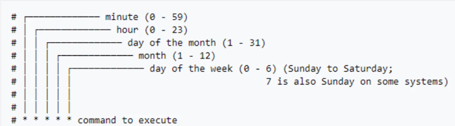

<br />

## Network Policy
`ingress`: who can talk to the pod  
`egress`: who the pod can talk to  

<div style="display: flex; gap: 20px">
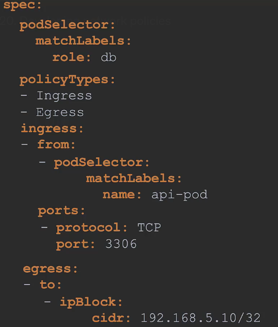  
<p>
Attach to pods with role "db", allow traffic comming from pods with the label api-pod.
Allow pod to communicate to "192.168.5.10/32".  
</p>
</div>
<br />

```yaml
spec:
  podSelector: {} # this apply to all pods
```

**Obs:** if one netpol allows a rule and another denies then the rule is allowed.  


### test connections
```bash
# ingress connection to the pod
k run db --restart=Never --rm -i --image=busybox -- wget -O [pod_id]:[port]

# egress connection from pod to internet
k exec [pod] -- wget -O www.google.com

# test port on another port
# a service name gets resolved when it is exposed by clusterip
# nc -v (verbose) - z(test port, does not send data) -w(timeout limit)
k exec [pod] --it -- nc -vz -w 2 [service] [port]
```

<br />
<div style="display: flex; gap: 20px">
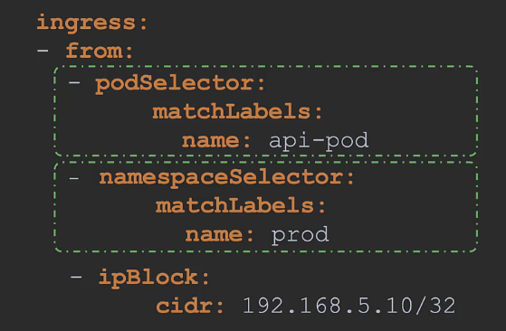  
<p>
Attach to pods with role "db", allow traffic comming from pods with the label api-pod within namespace prod.
</p>
<br /><br />
</div>
<br />

### example:

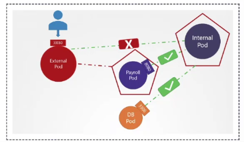  

[(see internal-network-policy.yaml)](internal-network-policy.yaml)  
[(see payroll-network-policy.yaml)](payroll-network-policy.yaml)  

In this case np is blocking the internal pod from accessing the external pod.  
The internal pod can access payload and db, also 53 TCP/UDP is allowed.  

**To test:**
```bash
# this should hang
exec internal -it -- wget -O- www.google.com

# this should respond
exec internal -it -- wget -O- payload:8080
```

<br />

## Volume
[(see volume.yaml)](volume.yaml)  

`volumeMounts.mountPath`: mount path inside the container  
`volumes.[type].path`: path on the node file system  

[(see persistent-volume.yaml)](persistent-volume.yaml)  


<details>
  <summary><strong>Volume types</strong></summary>
  <code>emptyDir</code>: Created when a Pod is assigned to a Node. Is deleted when the pod gets deleted.  <br />
  <code>hostPath</code>: These persist outside the Pod lifecycle.  <br />
  <code>configMap</code>: Mount key-value pairs as files from a ConfigMap.  <br />
  <code>secret</code>: Mount sensitive data from a Secret as files.  <br />
  <code>awsElasticBlockStore</code>: AWS EBS volume  <br />
</details>

<details>
  <summary><strong>emptyDir vs hostPath</strong></summary>

  | Feature        | `emptyDir`                      | `hostPath`                                |
  | -------------- | ------------------------------- | ----------------------------------------- |
  | Backed by      | Node local disk or memory       | Specific path on the node                 |
  | Lifetime       | Lives during the pod's lifetime | Lives as long as the node                 |
  | Pod restart    | ✅ Keeps data                    | ✅ Keeps data (if same node)               |
  | Pod reschedule | ❌ Loses data                    | ❌ Only works if re-scheduled to same node |
  | Security       | Safe                            | Risky — access to host                    |
  | Use case       | Temp space, shared cache        | Debugging, accessing host files           |
</details>


### Persistent volume claim  

[(see persistent-volume-claim.yaml)](persistent-volume-claim.yaml)  
[(see pod-claim-volume.yaml)](pod-claim-volume.yaml)  
[(see storage-class.yaml)](storage-class.yaml)  

attach pod to the pvc to claim the volume available.  
attach storageClass to pvc to create the aws resource automatically. 

```bash
# check mounted volumes
kubectl exec [pod] -it -- mount
# or
kubectl exec [pod] -it -- df -h
```

<details>
  <summary><strong>What happens when you delete a PVC?</strong></summary>

  | `persistentVolumeReclaimPolicy` | What happens to PV after PVC deletion?                                                                                  |
  | ------------------------------- | ----------------------------------------------------------------------------------------------------------------------- |
  | **Delete**                      | The PV **and the underlying storage** are deleted automatically. (Common in cloud-managed storage like AWS EBS, GCE PD) |
  | **Retain**                      | The PV **remains** but is marked as `Released`. Data remains on disk, manual cleanup is required before reuse.          |
</details>


<br />


## ConfigMap
```bash
k create -f configmap.yaml
k -n [namespace] create configmap [configmap] generic --from-literal [key]=[value] --from-literal [key]=[value]

# print envs from pod
k exec [pod] -it -- env
```

`--from-file`: filename becomes the key, file content becomes the value.  
`--from-env-file`: keys and values taken from inside the file.  

[(see configmap.yaml)](configmap.yaml)  

### Use configmap as enviroment variable
[(see pod-env-use-configmap.yaml)](pod-env-use-configmap.yaml)  

### Use configmap as mounted volume
Each key in the Configmap becomes a file in a directory.  
[(see pod-volume-use-configmap.yaml)](pod-volume-use-configmap.yaml)  

### Configmap from a file
```bash
kubectl create configmap [configmap_name] --from-file=(key)=(file)
```
Create a  file at `/etc/config/config-path` inside de container  
[(see pod-volume-use-configmap-from-file.yaml)](pod-volume-use-configmap-from-file.yaml) 

<br />

## Secret
```bash
k create -f secret.yaml
k -n [namespace] create secret [secret] generic --from-literal [key]=[value] --from-literal [key]=[value]
```
[(see secret.yaml)](secret.yaml)  

### Use secret as enviroment variable
[(see pod-env-use-secret.yaml)](pod-env-use-secret.yaml)  


### Use secret as mounted volume
Each key in the Secret becomes a file in a directory.  
[(see pod-volume-use-secret.yaml)](pod-volume-use-secret.yaml)  

<br />

## Statefulset  

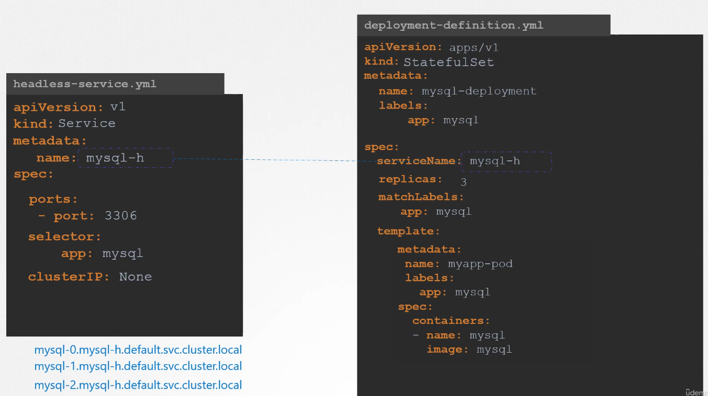  

### Volume Claim Template

Each pod will have a different storage

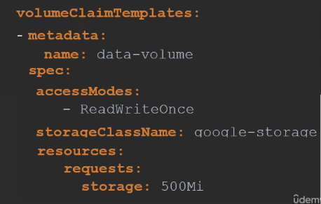  

<br />

## Roles  

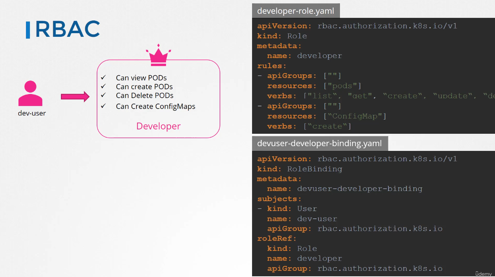  

`resourceNames`: array containing the access for resources by name.  

**Obs:** The role only allow access within the namespace.  

```bash
# check if user have permission to execute given command
# --as [user] // check user
kubectl auth can-i [command] [resource]
```

### Cluster Role for Nodes

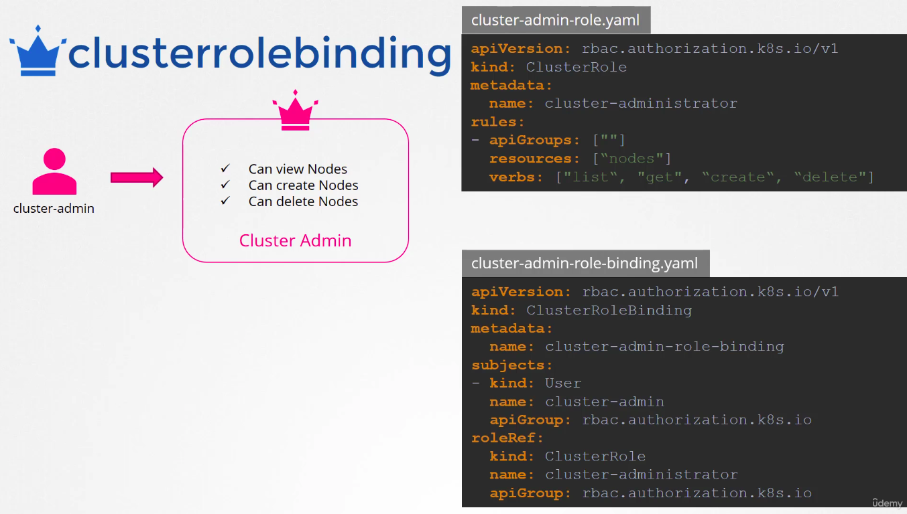 