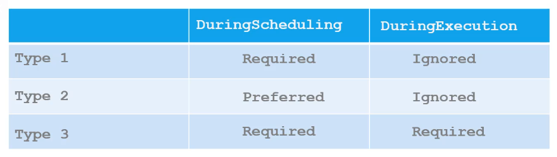
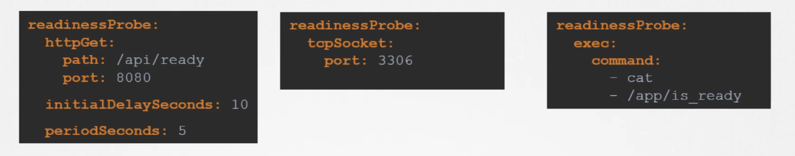

# kubernetes

[Deployment](#deployment)  
[Service](#service)  
[Replicate](#replicaset)  
[Inside Container](#inside-container)  
[Taint Tolerate](#taint-tolerate)  
[NodeSelector and Label](#nodeselector-and-label)  
[Affinity and Label](#affinity-and-label)  
[InitContainer](#initcontainer)  
[Readiness and Liveness Probe](#readiness-and-liveness-probe)  
<br />

```bash
# kubectl version
kubernetes version runing inside the node

# list all resources from namespace
kubectl get all --namespace=[namespace]

kubectl [command] [resource] [resource_name]
# commands: create, delete, edit, describe
# resources: pod, node, deploy, service, replicaset

# create a new pod yaml file
kubectl run redis --image=redis --dry-run -o yaml > redis.yaml
kubectl create deploy --image=nginx --dry-run -o yaml > deploy.yaml
# --dry-run // not to run
# -o yaml // display in a yaml file

# apply updates to current created resource
kubectl create -f redis.yaml
kubectl apply -f redis.yaml

# delete the preview resource then deploy the new one
kubectl replace --force -f [file.yaml]

# edit file vim and upload the updates on save
kubectl edit pod [pod]

# get all logs from container inside the pod
kubectl logs [pod] -c [container] 

```
<br />

## Deployment
```bash
kubectl create deploy httpd-frontend --image=httpd:2.4-alpine --replicas=3
kubectl set deploy [deployment] [image]


# rollout
kubectl rollout status [deployment]
kubectl rollout history [deployment]
```
<br />

## Service
```bash
# display service url
minikube service [service] --url
```
<br />

## Replicaset
```bash
# replace replicaset // it wont automatically replace the existing pods
kubectl replace -f replicaset.yaml

# scale without updating the file
kubectl scale --replicas=6 -f replicaset.yaml

# create a temporary replicaset edit file that will upload the changes
# edit does not automatically replace the current pods
kubectl edit replicaset [replicaset]
```
<br />

## Inside Container
```bash
# container user
kubectl exec [pod] -- whoami

kubectl exec -it [pod] -c [container] -- [command]
```
<br />

## Taint Tolerate
"Keep pods away unless they explicitly tolerate me"

[Pod tolerate (see example)](pod-tolerate.yaml)
```bash
kubectl taint node [node] [key]=[value]:[effect]
```
#### Effect
`NoSchedule` → Don't schedule unless tolerated  
`PreferNoSchedule` → Try to avoid, but not enforced  
`NoExecute` → Evicts existing pods unless tolerated  

<br />

## NodeSelector and Label
"I want my pod to go there"

### Label the node
```bash
kubectl label nodes [node] [label]=[value]
```

### NodeSelector
[Pod NodeSelector (see example)](pod-nodeSelector.yaml)
<br />
<br />

## Affinity and Label
"I want my pod to go there"  

[Pod Affinity (see example)](pod-affinity.yaml)

### yaml config

<details>
  <summary>operator <code>IN, OR, NotIn, Exists </code></summary>
  
  IN: 
  ```yaml
  - matchExpressions:
    - key: disktype
      operator: In
      values:
      - ssd
  ```

  Exists:
  ```yaml
  - matchExpressions:
    - key: color
      operator: Exists
  ```
</details>

<details>
  <summary> type</summary>
  
  type1: `preferredDuringSchedulingIgnoredDuringExecution`  
  type2: `requiredDuringSchedulingIgnoredDuringExecution`  
  type3: `requiredDuringSchedulingRequiredDuringExecution`  

  
</details>

<details>
  <summary>nodeAffinity, podAffinity</summary>
  
  #### nodeAffinity
  "Schedule this pod on nodes with specific labels."  
  &emsp; • Targets: Nodes  
  &emsp; • Uses: Node labels  
  &emsp; • Purpose: Restrict or prefer scheduling on certain nodes  

  #### podAffinity
  "Schedule this pod near (on the same node or zone as) other matching pods."  
  &emsp; • Targets: Pods (on other nodes)  
  &emsp; • Uses: Pod labels, plus topology (e.g. node, zone)  
  &emsp; • Purpose: Co-locate related pods for performance, latency, or shared resources  

</details>

<br />

## InitContainer
[(see example)](pod-init-container.yaml)

• Kubernetes runs all Init Containers sequentially.  
• Each must complete successfully (exit 0) before the next starts.  
• If one fails, it will retry until it succeeds or the Pod fails.  
• Once all Init Containers finish, the main containers start.  

<br />

## Readiness and Liveness Probe



`livenessProbe`: If it fails Kubernetes will restart the container.
`readinessPobe`: If it fails, the pod is removed from the Service’s load balancer. The container is not restarted, just marked as not ready.

---

`initialDelaySeconds`: This is the number of seconds to wait after the container starts before Kubernetes performs the first health check.  
`periodSeconds`: This is the interval between successive probes, after the initial delay.  

• Use a higher `initialDelaySeconds` if your app takes a while to initialize.  
• Use a short `periodSeconds` if you want quick detection of health/readiness issues.  

**Obs:** By setting `periodSeconds`, Kubernetes repeatedly checks the app's health — not just once. If it fails for a certain number of times (set by `failureThreshold`), the container is automatically restarted.
