# Nexjs

**Obs:** Server Components can include Client Components — not the other way around.

## Server Component

### Limitations:

## Client Component

### Limitations:
Can not import or define server components into it.  

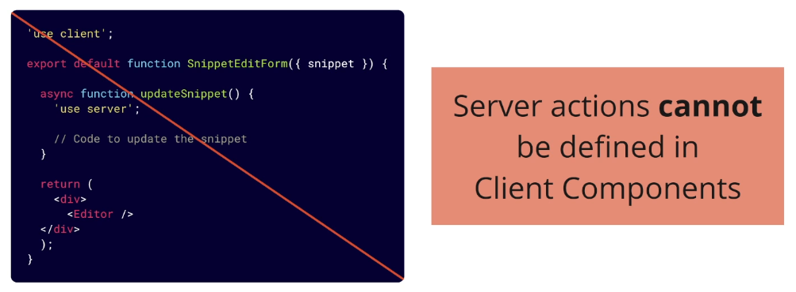

### Calling Server Action from Client Component

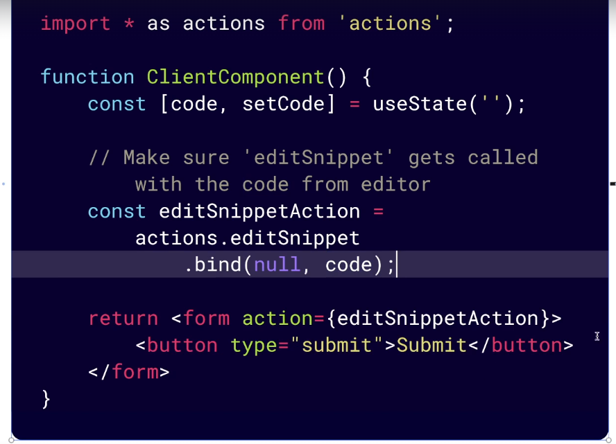
Form will work even if the user isn't running JS in their browser.
  

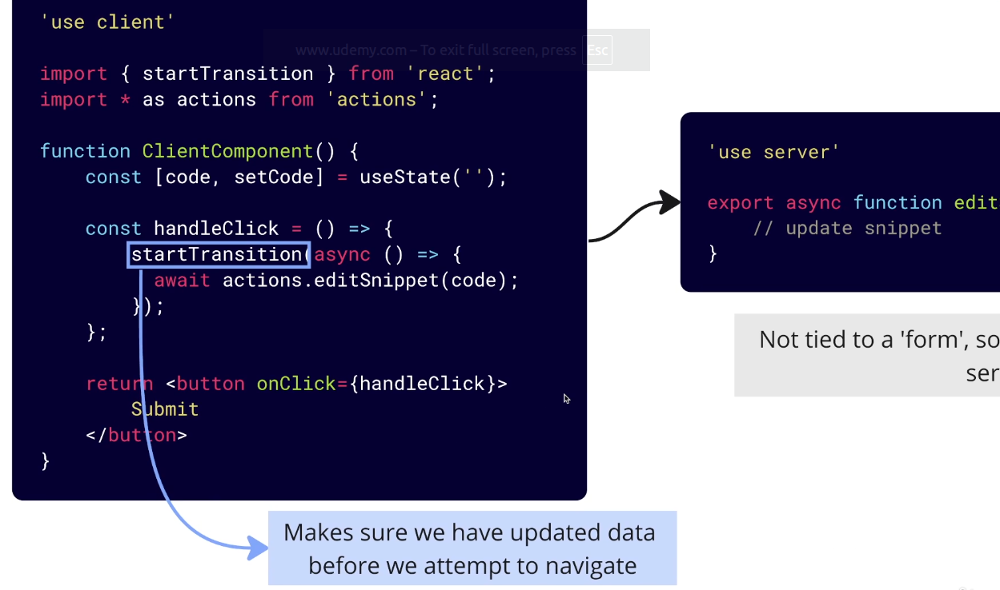

 

## Static vs Dynamic Page

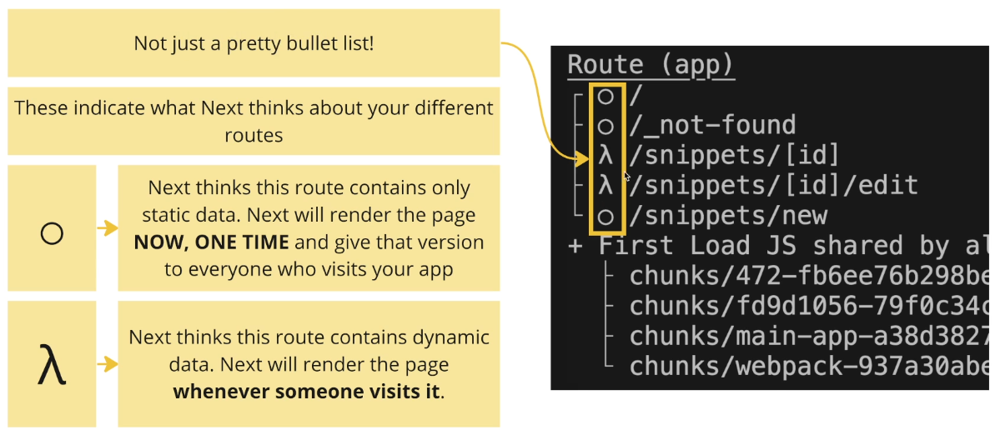

 

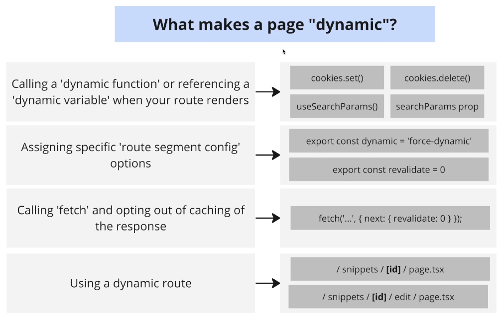

 

**Obs:** Nextjs renders dynamic path with wildcard variable dynamicly by default. Run generateStaticParams to render it staticaly.  
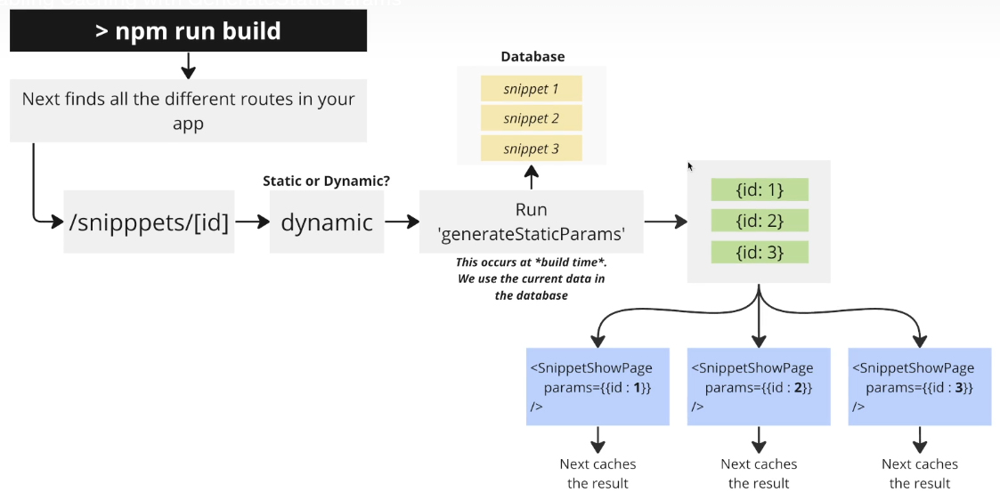

## Cache control

### Time-Based
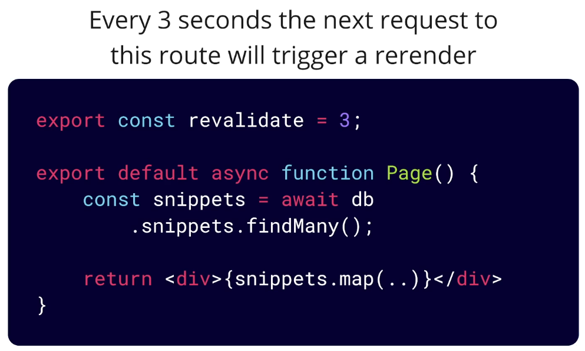

### On Demand
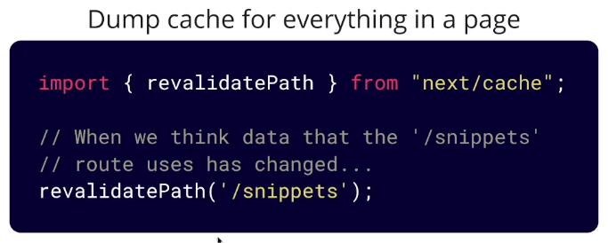

### Disable Caching
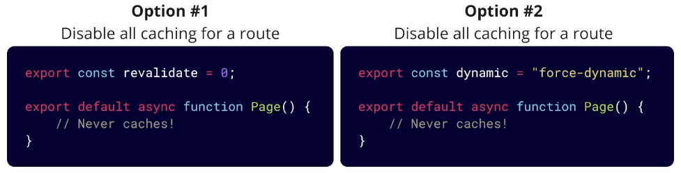

 

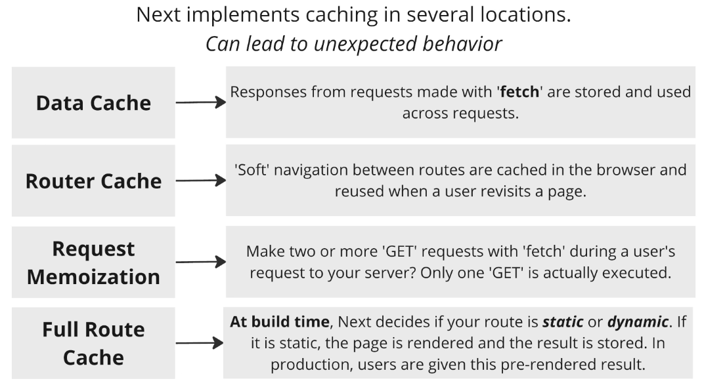

## Nextjs Auth

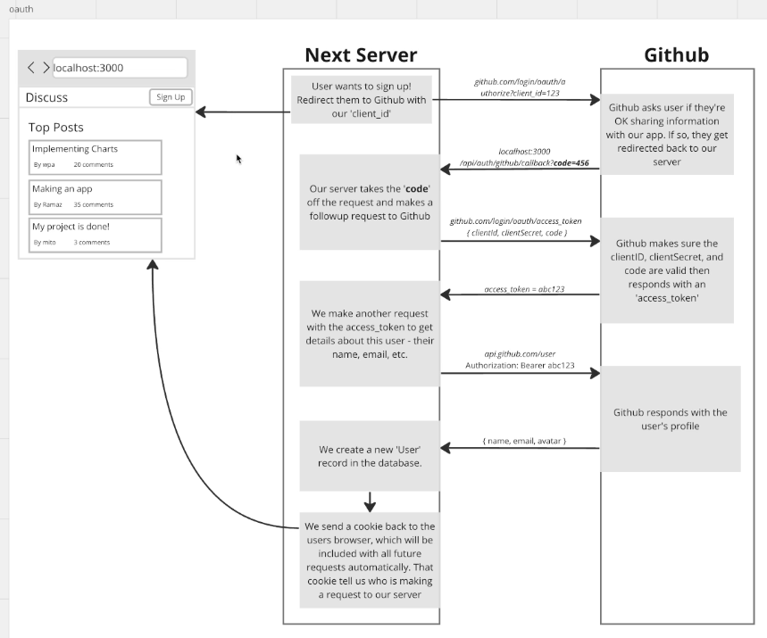

## Nextjs session

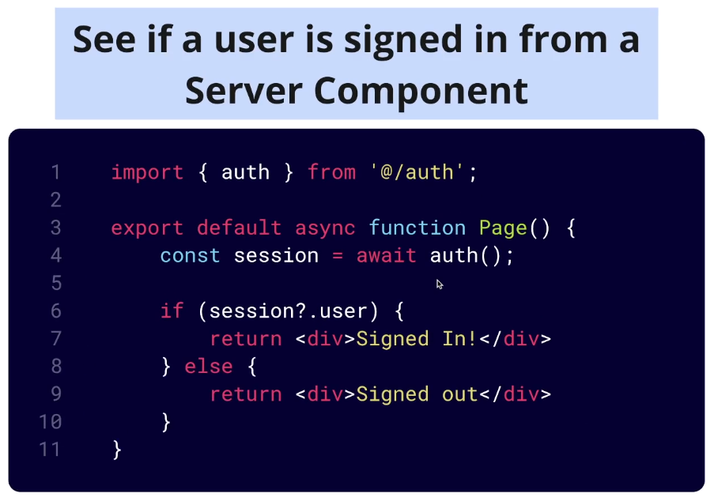

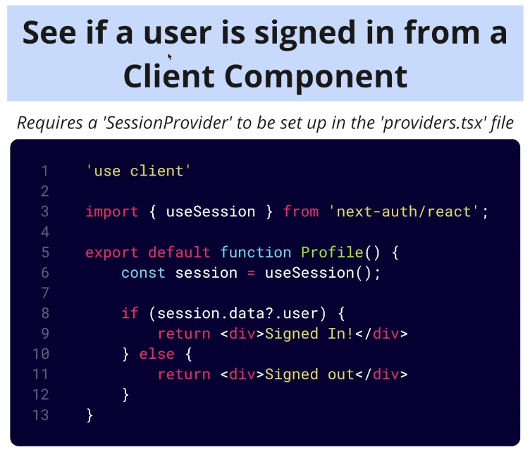