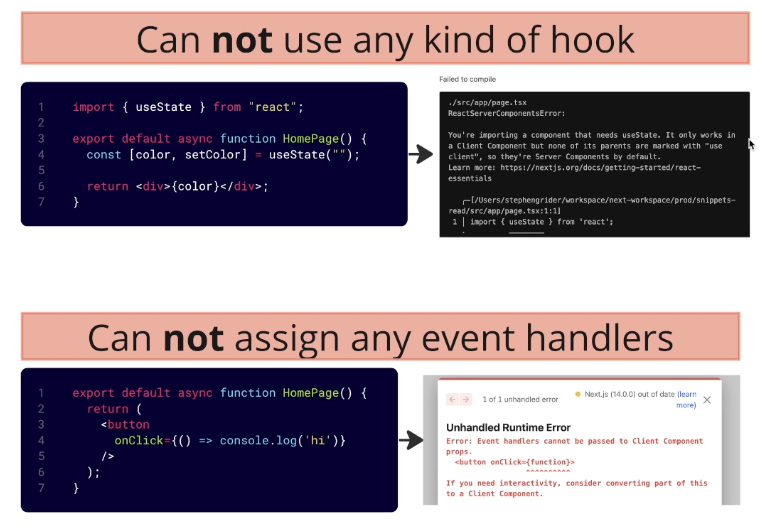

# Nexjs

**Obs:** Server Components can include Client Components — not the other way around.

## Server Component

### Limitations:

## Client Component

### Limitations:
Can not import or define server components into it.  

### Calling Server Action from Client Component

Form will work even if the user isn't running JS in their browser.
  

 

## Static vs Dynamic Page

 

 

**Obs:** Nextjs renders dynamic path with wildcard variable dynamicly by default. Run generateStaticParams to render it staticaly.  

## Cache control

### Time-Based

### On Demand

### Disable Caching

 

## Nextjs Auth

## Nextjs session

