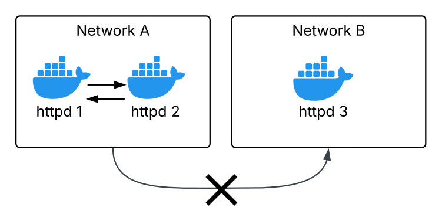
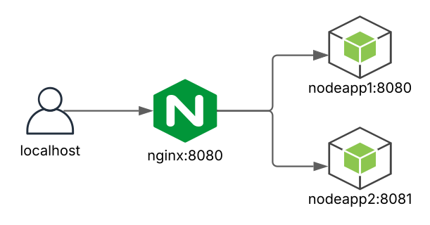

## Docker communication between networks

The containers can only communicate when their are in the same network.  

[see readme.md](docker/labs/network/1-communication-between-networks/readme.md)

 

## Nginx redirects to nodes

• two node containers and nginx inside the network (backendnet).  
• the `nginx.conf` file is volume binded.  
• nginx on port 80 redirects to the two node containers. 

[see readme.md](nginx/labs/2-nginx-redirect-to-nodes/readme.md)
